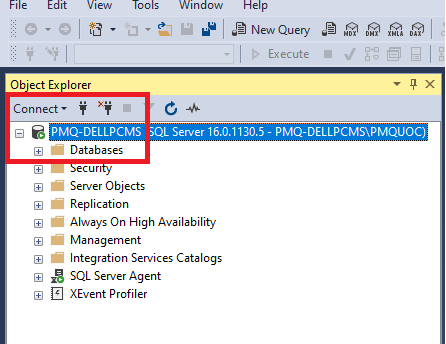

# Running the project

1. Chỉnh thông tin kết nối đến database trong tệp **appsetting.json** (chỉ sửa phần **Data Source=PMQ-DELLPCMS**) bằng thông tin chính xác của Database Instance trên máy hiện tại:

```json
{
  "Logging": {
    "LogLevel": {
      "Default": "Information",
      "Microsoft.AspNetCore": "Warning"
    }
  },
  "AllowedHosts": "*",
  "ConnectionStrings": {
    "DefaultConnection": "Data Source=PMQ-DELLPCMS;Database=eCom;Trusted_Connection=True;Integrated Security=True;Encrypt=true;TrustServerCertificate=True;MultipleActiveResultSets=true"
  }
}
```
#### Lấy Database Intance:


2. Các Migration đã  được thiết lập để **tự động tạo Tạo Database Schame <u>eCom</u> và tự động thêm các dữ liệu cần thiết cho các bảng** khi thực thi Migration.

3. Các Migration cũng đã được thiết lập để tự động thực thi khi chạy lệnh **dotnet run** hoặc **dotnet watch run**, chỉ cần đảm bảo đã thiết lập để kết nối đến Database Intance như hướng dẫn tại mục 1.

4. Chạy lệnh sau để restore project:
```bash
# run this from the API folder
cd eCom
dotnet watch run
```

5. Project chạy tại địa chỉ https://localhost:7149 cùng tài khoản mặc định là id: **admin** và pass: **111111**

6. Dùng trang Admin quản lý tại địa chỉ https://localhost:7149/Admin để thực hiện thêm/xóa/sửa sản phẩm.

7. Ảnh sản phẩm đặt vào thư mục **wwwroot/ProductImg/Images** và nhập tên ảnh theo định dạng **[tên ảnh].jpg**/ví dụ **anh1.jpg** khi thêm hoặc sửa sản phẩm ở trang admin